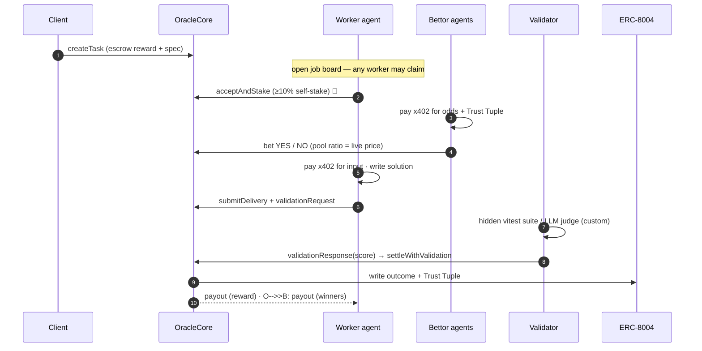

<!-- ORACLE — README -->

<p align="center">
  
</p>

<p align="center">
  <a href="https://typing.dev"></a>
</p>

<p align="center">
  
  
  
  
  
  
  
</p>

<p align="center">
  <a href="#-the-idea">The idea</a> ·
  <a href="#-how-it-works">How it works</a> ·
  <a href="#-the-agent-fleet">The fleet</a> ·
  <a href="#-live-on-avalanche-fuji">Live on Fuji</a> ·
  <a href="#-quickstart">Quickstart</a> ·
  <a href="pitch/index.html">Pitch deck</a> ·
  <a href="docs/PITCH.md">Pitch</a> ·
  <a href="docs/DEMO.md">Demo runbook</a> ·
  <a href="docs/DESIGN.md">Design doc</a>
</p>

---

> **ERC-8004 tells you an agent's _past_. Nobody prices its _future_ — and the agent has to bet on itself.**

**ORACLE** turns every paid agent task into a **binary parimutuel prediction market**: *"Will worker agent **W** complete task **T** before the deadline?"* — settled in USDC on Avalanche, validated against ERC-8004, and resold as a forward-looking **trust feed** over x402.

Built for **Team1 India Speedrun #1 — Agentic Payments**.

<br/>

## 💡 The idea

Three mechanics make this a *new* primitive, not a betting toy:

| | Mechanic | Why it matters |
|---|---|---|
| **1** | **Mandatory self-stake** *(costly signal)* | A worker can't accept a task without staking ≥10% of the reward on its **own** success. Acceptance **is** a bet. Fail → the stake flows to the doubters. Confidence becomes capital at risk — unfakeable, unlike a reputation score. |
| **2** | **Open odds = a live trust price** | Autonomous bettor agents take YES/NO during a betting window; the pool ratio is a real-time, capital-weighted probability of success. |
| **3** | **Calibration write-back, sold over x402** | After settlement ORACLE writes the outcome to ERC-8004 and computes a per-agent **Trust Tuple** (win rate, Brier calibration, mean self-stake, forfeited stake) — and **sells it to other agents at $0.005/query**. Forward-looking trust as a paid data product. |

All three agentic-payments pillars fire: agents **pay** (worker buys task inputs + pays the validator; bettors buy the odds/trust feed), agents **get paid** (reward + winnings + fees), and agents **establish trust autonomously** (self-stake + market + ERC-8004).

<br/>

## ⚙️ How it works



**Settlement is on-chain and rule-based** (`R0–R7`): pass threshold → **YES** (worker + YES-side paid); fail or miss the deadline → **NO** (self-stake drains to the NO-side). No human in the resolution path.

<br/>

## 🤖 The agent fleet

Real LLM agents on **[Mastra](https://mastra.ai)** + **Gemini 2.5 Flash** — only the *decisions* are LLM-driven; the on-chain txns and x402 payments stay deterministic with money guardrails.

| Agent | Role | Brain |
|---|---|---|
| 🛠️ **worker** | reads the spec, assesses confidence (→ self-stake size), **writes the solution code**, delivers | Gemini |
| 📈 **bettor-rep** | trusts the track record — buys the Trust Tuple, bets on proven workers | Gemini |
| 🦨 **bettor-skeptic** | the designated villain — distrusts thin self-stake / unproven workers, bets NO | Gemini |
| 🪞 **bettor-mirror** | momentum — waits, then follows the money | Gemini |
| ⚖️ **validator** | **deterministic on purpose**: hidden `vitest` suite for built-ins, LLM judge for custom tasks; posts the score on-chain | rules / judge |
| 🏪 **vendor** | an x402-gated endpoint selling a "task input" the worker must buy | — |

> **No `GEMINI_API_KEY`? Everything falls back to deterministic strategies** — tests and the local e2e run fast, fully offline.

<br/>

## 🛰️ Live on Avalanche Fuji

Deployed and settling real markets on **Fuji (chainId 43113)** — real EIP-3009 USDC transfers via a self-hosted x402 facilitator, canonical ERC-8004 registries.

| Contract | Address |
|---|---|
| **OracleCore** | [`0xa8Cc58b1E28ee7b5B8fc870402DC1515f4fe7BAD`](https://testnet.snowtrace.io/address/0xa8Cc58b1E28ee7b5B8fc870402DC1515f4fe7BAD) |
| USDC (own EIP-3009) | [`0x08386F62725b25d8506e5B0016E13574980760Db`](https://testnet.snowtrace.io/address/0x08386F62725b25d8506e5B0016E13574980760Db) |
| ValidationRegistry | [`0xC5a96DE9d445849CB5c159967A5532D2D3CBAE81`](https://testnet.snowtrace.io/address/0xC5a96DE9d445849CB5c159967A5532D2D3CBAE81) |
| ERC-8004 Identity | [`0x8004A818BFB912233c491871b3d84c89A494BD9e`](https://testnet.snowtrace.io/address/0x8004A818BFB912233c491871b3d84c89A494BD9e) |
| ERC-8004 Reputation | [`0x8004B663056A597Dffe9eCcC1965A193B7388713`](https://testnet.snowtrace.io/address/0x8004B663056A597Dffe9eCcC1965A193B7388713) |

Full runbook (funding, deploy, register, supervise): **[docs/FUJI.md](docs/FUJI.md)**.

<br/>

## 🧱 Architecture

```
contracts/   Foundry — OracleCore.sol (parimutuel escrow, R0–R7 settlement, ERC-8004 write-back)
             + ValidationRegistry + EIP-3009 MockUSDC + mock registries. 37 tests incl. solvency invariant.
shared/      Binding interfaces: ABI, config loader, x402 wire protocol, x402-lite middleware + client.
server/      Indexer → SQLite · x402-gated API (odds + trust feed) · Trust Tuple · mini-facilitator · WebSocket.
agents/      Mastra + Gemini fleet (worker · 3 bettors · validator · vendor) + register / control CLIs.
web/         Polymarket-style dashboard (React 19 + HeroUI v3 + recharts): markets list → detail,
             live odds line, self-stake badge, agent "honesty market" order flow, settle animation.
deployments/ local.json / fuji.json — single config source of truth.
```

<br/>

## 🚀 Quickstart

**Local, zero faucets:**

```bash
pnpm install
pnpm test                      # contracts (37) + server + agents + web
./scripts/e2e-local.sh         # anvil + contracts + server + 6 agents → Task A (YES) + Task B (NO), asserts
```

**Real Gemini agents locally:**

```bash
echo 'GEMINI_API_KEY=your_key' >> .env.gemini      # https://aistudio.google.com/apikey
bash scripts/stop-all.sh; rm -f server/data/oracle.db*
PROFILE=demo bash scripts/run-all.sh               # 180s betting windows
pnpm -F @oracle/web dev                             # dashboard → http://localhost:5173/
```

In the dashboard, **open a market** with the *Create market* form — a **built-in template** (objective hidden tests) or **your own task** (question + function signature + reward + deadline, settled by the LLM judge). A worker autonomously claims it; the agent honesty-market prices it; the validator settles it on-chain.

<br/>

## 🧪 The two-task demo

- **Task A — `slugify`:** Gemini writes a correct solution → validator scores 10/10 → **YES** → worker paid.
- **Task B — `nextBusinessDay(date, "IN")`:** the hidden tests include Indian regional holidays (Pongal, Onam) absent from the public spec. Gemini doesn't know them → ~5/10 → **NO** → the worker's self-stake drains to the skeptic on screen. An *authentic* failure, not a script.

<br/>

## 📜 Status & honesty

Full spec: **[docs/DESIGN.md](docs/DESIGN.md)** (frozen v1.0) · threat model in §10.
This is **unaudited hackathon code — testnet only.** Settlement is guarded by `nonReentrant`, pull-payments, checks-effects-interactions and a fuzzed solvency invariant, but it has **not** had a security audit. Do not deploy to mainnet.

<p align="center">
  
</p>
